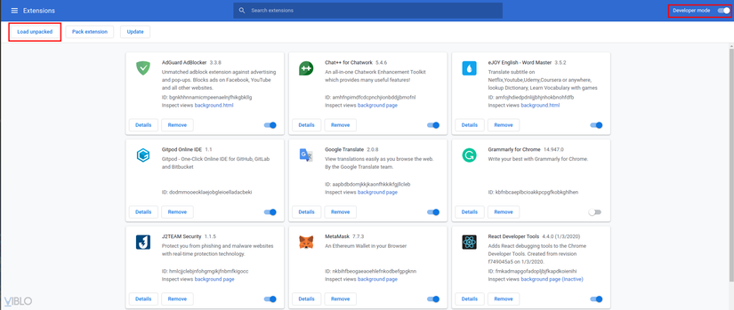
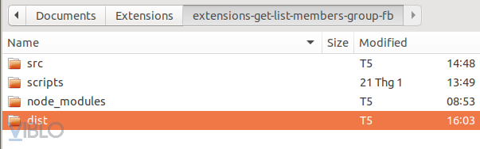
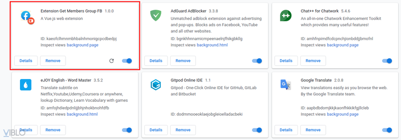

# Extension-get-members-group-fb
Extensions with the ability to get all the link profile members of a facebook group
##### Install and build extension

1. `git clone https://github.com/ngovannghia1997kma/extension-get-members-group-fb.git`
2. `cd extension-get-members-group-fb`
3. `npm install`

4. test `npm run watch:dev` :
- 
- 
- 
- 

5. build `npm run build` --> then the steps are similar to the `test` section

*Link Detailed instructions :* [Tạo Extension Get Tất Cả Profile Của Các Members Trong Một Group Facebook Ra File Excel](https://viblo.asia/p/tao-extension-get-tat-ca-profile-cua-cac-members-trong-mot-group-facebook-ra-file-excel-oOVlYLRaZ8W)
